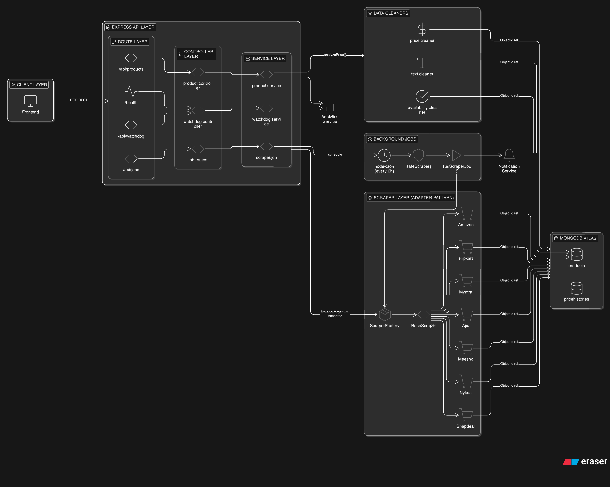

# 🔍 TrendCatcher Engine — Backend

> **A production-grade price tracking engine** that scrapes product prices from 7 Indian e-commerce platforms, detects price changes via a Watchdog system, and stores historical pricing data — designed to scale to **5,000+ products** without timeouts.

---

## 📑 Table of Contents

- [Architecture Overview](#-architecture-overview)
- [Key Design Decisions](#-key-design-decisions)
  - [1. How does the system handle scraping 5,000 links without timing out?](#1-how-does-the-system-handle-scraping-5000-links-without-timing-out)
  - [2. How is data stored?](#2-how-is-data-stored)
  - [3. How do different components talk to each other?](#3-how-do-different-components-talk-to-each-other)
- [Project Structure](#-project-structure)
- [Tech Stack](#-tech-stack)
- [Getting Started](#-getting-started)
- [API Reference](#-api-reference)
- [Supported Platforms](#-supported-platforms)
- [Design Patterns Used](#-design-patterns-used)

---

## 🏗 Architecture Overview



```
┌─────────────────────────────────────────────────────────────────────────┐
│                         CLIENT (Frontend / cURL)                        │
└───────────────┬─────────────────────────────────────┬───────────────────┘
                │  HTTP REST API                      │
┌───────────────▼─────────────────────────────────────▼───────────────────┐
│                            EXPRESS APP (app.js)                          │
│  ┌──────────┐  ┌───────────────┐  ┌──────────────┐  ┌───────────────┐  │
│  │  CORS    │  │  JSON Parser  │  │  Static Files│  │  Error Handler│  │
│  └──────────┘  └───────────────┘  └──────────────┘  └───────────────┘  │
│                                                                         │
│  ┌─────────────────────────────────────────────────────────────────┐    │
│  │                      ROUTE LAYER                                │    │
│  │   /api/products    /api/watchdog    /api/jobs     /health       │    │
│  └────────┬──────────────┬──────────────┬─────────────────────────┘    │
│           │              │              │                               │
│  ┌────────▼──────────────▼──────────────▼─────────────────────────┐    │
│  │                    CONTROLLER LAYER                             │    │
│  │  product.controller  watchdog.controller   (inline in routes)  │    │
│  └────────┬──────────────┬──────────────┬─────────────────────────┘    │
│           │              │              │                               │
│  ┌────────▼──────────────▼──────────────▼─────────────────────────┐    │
│  │                     SERVICE LAYER                               │    │
│  │  product.service     watchdog.service     scraper.job           │    │
│  └────────┬──────────────┬──────────────┬─────────────────────────┘    │
│           │              │              │                               │
│  ┌────────▼──────────────┼──────────────▼─────────────────────────┐    │
│  │          SCRAPER LAYER (Adapter Pattern)                        │    │
│  │  ┌──────────────────────────────────────────┐                  │    │
│  │  │          ScraperFactory (Router)          │                  │    │
│  │  │    URL → hostname → matching scraper      │                  │    │
│  │  └─────┬────┬────┬────┬────┬────┬────┬──────┘                  │    │
│  │        │    │    │    │    │    │    │                           │    │
│  │  ┌─────▼┐┌─▼──┐┌▼───┐┌▼──┐┌▼───┐┌─▼──┐┌▼───────┐             │    │
│  │  │Amazon││Flip.││Myn.││Aji││Mees││Nyk.││Snapdeal│             │    │
│  │  │Scrap.││Scr. ││Scr.││Scr││Scr.││Scr.││Scraper │             │    │
│  │  └──┬───┘└──┬──┘└─┬──┘└─┬─┘└──┬─┘└──┬─┘└───┬────┘             │    │
│  │     └───────┴─────┴─────┴─────┴─────┴──────┘                   │    │
│  │            All extend BaseScraper                               │    │
│  └─────────────────────────────────────────────────────────────────┘    │
│                      │                                                  │
│  ┌───────────────────▼─────────────────────────────────────────────┐    │
│  │                    CLEANERS LAYER                                │    │
│  │  price.cleaner     availability.cleaner     text.cleaner        │    │
│  └─────────────────────────────────────────────────────────────────┘    │
│                                                                         │
│  ┌─────────────────────────────────────────────────────────────────┐    │
│  │                    SCHEDULED JOBS (node-cron)                    │    │
│  │  dailyCheck.job  →  scraper.job (batch processor)               │    │
│  │  ┌─────────────────────────────────────────────┐                │    │
│  │  │  safeScrape() → runScraperJob() → batches   │                │    │
│  │  │  overlap guard │ retry logic │ ETA tracking  │                │    │
│  │  └─────────────────────────────────────────────┘                │    │
│  └─────────────────────────────────────────────────────────────────┘    │
└─────────────────────────────────────────────────────────────────────────┘
                              │
┌─────────────────────────────▼───────────────────────────────────────────┐
│                         MongoDB Atlas                                   │
│  ┌────────────────┐    ┌───────────────────────┐                        │
│  │  products       │    │  pricehistories       │                        │
│  │  ─────────────  │    │  ───────────────────  │                        │
│  │  name           │◄───│  product (ObjectId)   │                        │
│  │  url (unique)   │    │  price                │                        │
│  │  currentPrice   │    │  previousPrice        │                        │
│  │  highestPrice   │    │  status (ENUM)        │                        │
│  │  lowestPrice    │    │  priceDifference      │                        │
│  │  averagePrice   │    │  percentageChange     │                        │
│  │  source         │    │  source               │                        │
│  │  totalChecks    │    │  checkedAt            │                        │
│  │  lastCheckedAt  │    └───────────────────────┘                        │
│  │  isActive       │         Compound Index:                             │
│  └────────────────┘          { product: 1, checkedAt: -1 }              │
└─────────────────────────────────────────────────────────────────────────┘
```

---

## 🧠 Key Design Decisions

### 1. How does the system handle scraping 5,000 links without timing out?

This is the **most critical engineering challenge** in the system. Here's the multi-layered approach:

#### a) **Batch Processing with Controlled Concurrency**

```
5,000 products  →  chunk into batches of 50  →  100 batches
```

The scraper job (`jobs/scraper.job.js`) splits all active products into batches (default: **50 products per batch**). Within each batch, all products are scraped **concurrently** using `Promise.all()`. Between batches, a configurable **cooldown delay** (default: 3 seconds) prevents overwhelming target servers.

```javascript
// Inside runScraperJob():
const batches = chunk(products, batchSize);  // 50 per batch

for (let i = 0; i < batches.length; i++) {
    // All 50 products in this batch scraped in PARALLEL
    const batchResults = await Promise.all(
        batch.map(product => processProduct(product))
    );
    
    // 3-second cooldown before next batch
    await sleep(delayMs);
}
```

**Why this works for 5,000:** At 50 products/batch with ~2s avg per batch + 3s delay = ~5s per batch. 100 batches × 5s = **~8.3 minutes** total. The job runs in the **background** (fire-and-forget via `POST /api/jobs/scrape`), so no HTTP timeout applies.

#### b) **Fire-and-Forget API Design**

```
POST /api/jobs/scrape  →  202 Accepted (returns immediately)
                        →  Job runs in background
                        →  GET /api/jobs/status  (poll for progress)
```

The API returns `202 Accepted` **instantly** while the scraper runs asynchronously. This completely decouples the HTTP request lifecycle from the scraping duration. Even if scraping takes 30 minutes, the client never times out.

#### c) **Exponential Backoff Retry**

Each product gets **3 retry attempts** with exponential backoff (1s → 2s → 4s). This handles transient failures (network hiccups, rate limiting) without crashing the entire job.

```javascript
const withRetry = async (fn, maxRetries = 3, baseDelay = 1000) => {
    for (let attempt = 1; attempt <= maxRetries; attempt++) {
        try {
            return await fn();
        } catch (error) {
            if (attempt < maxRetries) {
                const delay = baseDelay * Math.pow(2, attempt - 1);  // 1s, 2s, 4s
                await sleep(delay);
            }
        }
    }
    throw lastError;
};
```

#### d) **Per-Request Timeouts**

Each HTTP request to an e-commerce site has a **15-second timeout** (20s for Flipkart). This prevents a single slow/hanging page from blocking the entire batch.

```javascript
// BaseScraper.fetchPage()
const { data } = await axios.get(url, {
    timeout: 15000,  // 15s hard limit per request
});
```

#### e) **Overlap Guard**

A mutex (`isJobRunning` flag) prevents multiple scraping jobs from running simultaneously, avoiding resource contention and duplicate price history entries.

```javascript
const safeScrape = async () => {
    if (isJobRunning) {
        console.log("⚠️ Scraper job already running — skipping");
        return null;
    }
    isJobRunning = true;
    // ... run the job ...
    isJobRunning = false;
};
```

#### f) **Graceful Failure Handling**

Every single product scrape is wrapped in a try-catch. A **failed product never crashes the job** — it's simply logged as `FAILED` in the results, and the next product continues.

```
Result per product: SUCCESS | FAILED | SKIPPED
```

**Summary: The 5,000-link strategy**

| Strategy               | Problem Solved                              |
|------------------------|---------------------------------------------|
| Batch + `Promise.all`  | Controlled concurrency, resource management |
| Fire-and-forget API    | No HTTP timeout on the client side          |
| Exponential backoff    | Transient failures, rate limiting           |
| Per-request timeout    | Hanging pages don't block the pipeline      |
| Overlap guard          | No duplicate concurrent runs                |
| Graceful error capture | One failure doesn't crash the entire job    |

---

### 2. How is data stored?

#### Database: **MongoDB Atlas** (via Mongoose ODM)

Two collections power the entire system:

#### `products` Collection

Stores the **current state** of each tracked product. Think of it as the "live dashboard" — always up-to-date with the latest price.

| Field          | Type       | Purpose                                    |
|----------------|------------|---------------------------------------------|
| `name`         | String     | Product title (scraped or user-provided)    |
| `url`          | String     | Unique product URL (dedup key)              |
| `currentPrice` | Number     | Latest scraped price                        |
| `highestPrice` | Number     | All-time high (auto-tracked)                |
| `lowestPrice`  | Number     | All-time low (auto-tracked)                 |
| `averagePrice` | Number     | Running average (O(1) calculation)          |
| `source`       | String     | E-commerce platform (e.g., `amazon.in`)     |
| `totalChecks`  | Number     | How many times this product has been scraped|
| `lastCheckedAt`| Date       | Timestamp of the last successful scrape     |
| `isActive`     | Boolean    | Whether the product should be scraped       |

**Key indexes:** `name` (text search), `source` (filter by platform), `isActive` (job query).

#### `pricehistories` Collection

The **append-only audit log** — every price check creates a new document. This is what powers price trend charts and historical analysis.

| Field              | Type       | Purpose                                       |
|--------------------|------------|------------------------------------------------|
| `product`          | ObjectId   | Reference to the parent product                |
| `price`            | Number     | The scraped price at this point in time        |
| `previousPrice`    | Number     | What the price was before this check           |
| `status`           | Enum       | `CHEAPER` / `COSTLY` / `SAME`                  |
| `priceDifference`  | Number     | `newPrice - previousPrice` (negative = drop)   |
| `percentageChange` | Number     | % change from previous (e.g., `-12.5`)         |
| `source`           | String     | Platform identifier                            |
| `checkedAt`        | Date       | When this check was performed                  |

**Compound index:** `{ product: 1, checkedAt: -1 }` — optimized for the most common query: "get all checks for product X, newest first."

#### Why this schema design?

1. **Running Average (O(1)):** Instead of recalculating average from all history entries (O(n)), the system uses a running formula: `newAvg = ((oldAvg × count) + newPrice) / (count + 1)`. This keeps price aggregation **constant time** regardless of how many history entries exist.

2. **Pre-computed Status:** Each history entry stores `CHEAPER/COSTLY/SAME` at write time, so the API never needs to compute it on read. This is a classic **write-time optimization** for read-heavy workloads.

3. **Separate History Collection:** Instead of embedding price history as a subdocument array inside `Product`, it's a separate collection. This prevents the **16MB document size limit** from being hit as history grows (5,000 products × 4 checks/day × 365 days = 7.3M entries).

---

### 3. How do different components talk to each other?

The system uses a **layered architecture** with strict dependency direction: each layer only calls the layer directly below it. Here's the flow:

```
HTTP Request
    ↓
[Routes]        → URL matching, route definition
    ↓
[Controllers]   → Input validation, HTTP response formatting
    ↓
[Services]      → Business logic, data orchestration
    ↓
[Scrapers]      → External HTTP calls, DOM parsing
[Cleaners]      → Data normalization
[Models]        → MongoDB CRUD via Mongoose
```

#### Communication Patterns

**Pattern 1: Synchronous Request-Response (API calls)**

```
Client → Route → Controller → Service → Model → MongoDB → Response
```

Example: `GET /api/products` → `product.routes.js` → `product.controller.js` → `product.service.js` → `Product.find()` → JSON response

**Pattern 2: Fire-and-Forget (Background Jobs)**

```
Client → POST /api/jobs/scrape → 202 Accepted (instant)
                                      ↓ (async, in background)
                            scraper.job.js → ScraperFactory → individual scrapers
                                      ↓
                            cleaners (normalize data)
                                      ↓
                            watchdog.service.js (compare + store)
                                      ↓
                            Product.update() + PriceHistory.create()
```

The API handler kicks off `runScraperJob()` **without awaiting it**, then immediately responds. The job runs to completion in the background.

**Pattern 3: Scheduled Execution (Cron)**

```
node-cron (every 6 hours) → safeScrape() → runScraperJob()
                                  ↑
                          overlap guard (mutex)
```

The cron scheduler in `dailyCheck.job.js` fires every 6 hours (configurable via `CRON_SCHEDULE` env var). The `safeScrape()` wrapper prevents overlapping runs.

**Pattern 4: Adapter Pattern (Scrapers)**

```
ScraperFactory.scrape(url)
    ↓
ScraperFactory.resolve(url)    ← hostname keyword matching
    ↓
AmazonScraper.scrape(url)     ← specific DOM selectors
    ↓
BaseScraper.fetchPage(url)    ← shared HTTP + Cheerio logic
    ↓
return { title, price, availability }   ← standardized output
```

Every scraper **must** return the same `{ title, price, availability }` contract. The `ScraperFactory` resolves which scraper to use based on URL hostname keywords. Adding a new platform = create one file + register it in the factory.

**Pattern 5: Watchdog Pipeline (Scrape → Clean → Compare → Store)**

```
Raw scraped data: { title: "  Product  ", price: "₹ 1,999.00", availability: "In Stock" }
        ↓
Cleaners:
  cleanPrice("₹ 1,999.00")        → 1999
  cleanTitle("  Product  ")        → "Product"
  cleanAvailability("In Stock")    → true
        ↓
Watchdog:
  analyzePrice(productId, 1999)
        ↓
  1. Fetch current price from Product (e.g., 2499)
  2. Compare: 1999 < 2499 → status = "CHEAPER"
  3. Create PriceHistory entry
  4. Update Product: currentPrice=1999, lowestPrice=min(prev,1999), etc.
        ↓
  Return: { status: "CHEAPER", priceDifference: -500, percentageChange: -20.01 }
```

---

## 📁 Project Structure

```
backend/
├── api/
│   └── index.js                 # Vercel serverless entry point
├── cleaners/
│   ├── index.js                 # Barrel export for all cleaners
│   ├── price.cleaner.js         # "₹1,999.00" → 1999
│   ├── availability.cleaner.js  # "In Stock" → true
│   └── text.cleaner.js          # Whitespace normalization, truncation
├── config/
│   └── index.js                 # Environment constants
├── controllers/
│   ├── index.controller.js      # Health check
│   ├── product.controller.js    # Product CRUD endpoints
│   └── watchdog.controller.js   # Price comparison endpoints
├── db/
│   └── index.js                 # MongoDB connection (mongoose.connect)
├── docs/
│   └── API_CURLS.md             # cURL cheat sheet for all endpoints
├── jobs/
│   ├── dailyCheck.job.js        # Cron scheduler + overlap guard
│   └── scraper.job.js           # Batch processor + retry logic
├── middleware/
│   └── errorMiddleware.js       # Global 404 + error handler
├── models/
│   ├── product.model.js         # Product schema (current state)
│   └── priceHistory.model.js    # Price history schema (audit log)
├── routes/
│   ├── index.routes.js          # Health route
│   ├── product.routes.js        # /api/products
│   ├── watchdog.routes.js       # /api/watchdog
│   └── job.routes.js            # /api/jobs
├── scrapers/
│   ├── base.scraper.js          # Abstract base class
│   ├── scraperFactory.js        # URL → Scraper resolver
│   ├── amazon/
│   │   └── amazon.scraper.js
│   ├── flipkart/
│   │   └── flipkart.scraper.js
│   ├── myntra/
│   │   └── myntra.scraper.js
│   ├── ajio/
│   │   └── ajio.scraper.js
│   ├── meesho/
│   │   └── meesho.scraper.js
│   ├── nykaa/
│   │   └── nykaa.scraper.js
│   └── snapdeal/
│       └── snapdeal.scraper.js
├── services/
│   ├── index.js                 # Global service (health)
│   ├── product.service.js       # Product business logic
│   └── watchdog.service.js      # Price analysis + history
├── utils/
│   └── asyncHandler.js          # Express async error wrapper
├── app.js                       # Express app configuration
├── server.js                    # Entry point (DB connect → listen → cron)
├── vercel.json                  # Vercel deployment config
├── package.json
└── .gitignore
```

---

## ⚙ Tech Stack

| Technology    | Purpose                                              |
|---------------|------------------------------------------------------|
| **Node.js**   | Runtime                                              |
| **Express 5** | HTTP framework                                       |
| **MongoDB**   | Database (Atlas cloud)                               |
| **Mongoose**  | ODM for MongoDB — schemas, validation, indexing       |
| **Axios**     | HTTP client for scraping (with custom headers)       |
| **Cheerio**   | Server-side HTML parsing (jQuery-like)               |
| **node-cron** | Cron scheduler for automated price checks            |
| **dotenv**    | Environment variable management                      |
| **CORS**      | Cross-origin request handling                         |
| **Nodemon**   | Development auto-restart                              |

**Why not Puppeteer/Playwright?** These are heavy browser automation tools (~200MB+ install). The current approach uses lightweight **HTTP + Cheerio** (server-side DOM parsing), which is:
- **10x faster** per request (no browser startup)
- **50x less memory** (no headless Chrome)
- **Deployment friendly** (works on Vercel serverless, no Chrome binary needed)

Trade-off: Cannot scrape JS-rendered content. Mitigated by using **JSON-LD structured data** (Myntra, Ajio, Meesho, Nykaa) which is embedded in the initial HTML response.

---

## 🚀 Getting Started

### Prerequisites

- **Node.js** v18+
- **MongoDB Atlas** account (or local MongoDB)
- **npm** v9+

### Setup

```bash
# 1. Clone the repository
git clone https://github.com/Pranjal6955/TrendCatcherEngine.git
cd TrendCatcherEngine/backend

# 2. Install dependencies
npm install

# 3. Create environment file
cp .env.example .env
```

### Environment Variables

Create a `.env` file in the `backend/` directory:

```env
PORT=5000
MONGODB_URI=mongodb+srv://<username>:<password>@<cluster>.mongodb.net/<dbname>
NODE_ENV=development
CRON_SCHEDULE=0 */6 * * *
CORS_ORIGIN=http://localhost:3000
```

| Variable        | Description                                 | Default         |
|-----------------|---------------------------------------------|-----------------|
| `PORT`          | Server port                                 | `5000`          |
| `MONGODB_URI`   | MongoDB connection string                   | *required*      |
| `NODE_ENV`      | `development` or `production`               | `development`   |
| `CRON_SCHEDULE` | Cron expression for auto-scraping           | `0 */6 * * *`   |
| `CORS_ORIGIN`   | Allowed frontend origin                     | `*`             |

### Run

```bash
# Development (with hot-reload)
npm run dev

# Production
npm start
```

### Verify

```bash
# Health check
curl http://localhost:5000/

# Expected response:
# { "status": "OK", "message": "TrendCatcher API is running" }
```

---

## 📡 API Reference

### Products

| Method | Endpoint                      | Description                    |
|--------|-------------------------------|--------------------------------|
| `POST` | `/api/products`               | Add a product URL to track     |
| `POST` | `/api/products/bulk`          | Bulk add multiple product URLs |
| `GET`  | `/api/products`               | List all tracked products      |
| `GET`  | `/api/products/:id/history`   | Get price history for a product|

### Watchdog

| Method | Endpoint                           | Description                     |
|--------|------------------------------------|---------------------------------|
| `POST` | `/api/watchdog/check`              | Manually trigger a price check  |
| `GET`  | `/api/watchdog/:productId/summary` | Get watchdog summary & stats    |

### Jobs

| Method | Endpoint           | Description                              |
|--------|--------------------|------------------------------------------|
| `POST` | `/api/jobs/scrape` | Trigger background scraper (202 Accepted)|
| `GET`  | `/api/jobs/status` | Get cron job status & run history        |

> 📋 See [`docs/API_CURLS.md`](./docs/API_CURLS.md) for copy-paste cURL commands.

---

## 🛒 Supported Platforms

| Platform   | Scraping Strategy                | Anti-Bot Handling                  |
|------------|----------------------------------|------------------------------------|
| **Amazon** | DOM selectors (`#productTitle`)  | Browser-like User-Agent headers    |
| **Flipkart** | DOM selectors (class-based)   | Custom headers + Referer spoofing  |
| **Myntra** | JSON-LD + DOM fallback           | Structured data extraction         |
| **Ajio**   | JSON-LD + DOM fallback           | Structured data extraction         |
| **Meesho** | JSON-LD + DOM + meta tags        | Multi-layer fallback               |
| **Nykaa**  | JSON-LD + DOM + meta tags        | Multi-layer fallback               |
| **Snapdeal** | DOM selectors + meta tags      | Standard headers                   |

### Adding a New Platform

1. Create `scrapers/<platform>/<platform>.scraper.js`
2. Extend `BaseScraper`
3. Implement `scrape(url)` → return `{ title, price, availability }`
4. Register in `scrapers/scraperFactory.js`:

```javascript
import NewScraper from "./newsite/newsite.scraper.js";

// Add to registry
{ keywords: ["newsite"], scraper: new NewScraper() },
```

---

## 🎨 Design Patterns Used

| Pattern                  | Where                               | Why                                              |
|--------------------------|-------------------------------------|--------------------------------------------------|
| **Adapter Pattern**      | `scrapers/`                         | Uniform interface across 7 e-commerce sites      |
| **Factory Pattern**      | `scraperFactory.js`                 | URL → correct scraper resolution                 |
| **Repository Pattern**   | `services/` + Mongoose models       | Business logic separated from data access         |
| **Layered Architecture** | Routes → Controllers → Services    | Separation of concerns, testability               |
| **Barrel Exports**       | `cleaners/index.js`                 | Single import point for related modules           |
| **Mutex Guard**          | `dailyCheck.job.js`                 | Prevent concurrent scraper runs                   |
| **Fire-and-Forget**      | `job.routes.js`                     | Async job execution without HTTP timeout          |
| **Running Average**      | `watchdog.service.js`               | O(1) average price calculation                    |

---

## 📊 Deployment

### Vercel (Serverless)

The project includes `vercel.json` and `api/index.js` for Vercel deployment. The serverless handler caches DB connections across warm invocations:

```javascript
let isConnected = false;
const ensureConnection = async () => {
    if (!isConnected) {
        await connectDB();
        isConnected = true;
    }
};
```

> ⚠️ **Note:** Cron jobs (`node-cron`) won't run on Vercel serverless. Use [Vercel Cron Jobs](https://vercel.com/docs/cron-jobs) or an external cron service (e.g., cron-job.org) to hit `POST /api/jobs/scrape` periodically.

### Traditional Server (VPS/EC2)

```bash
npm start  # Cron jobs will run automatically
```

---

## 📜 License

ISC

---

<p align="center">
  Built with ☕ by <a href="https://github.com/Pranjal6955">Pranjal Negi</a>
</p>
